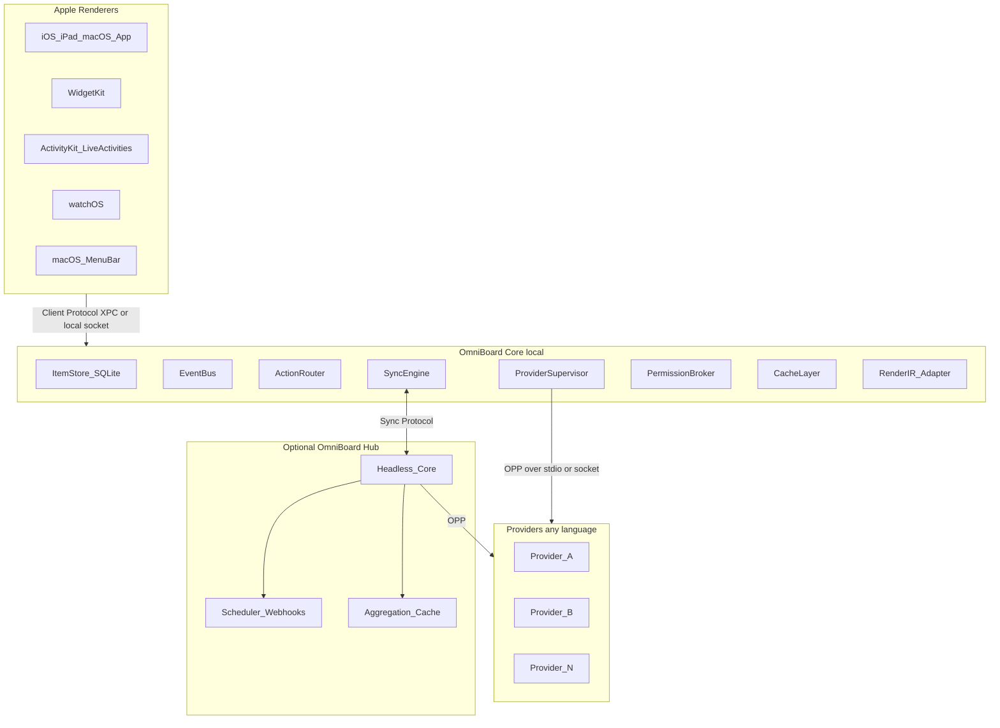

# OmniBoard Architecture

OmniBoard separates **domain knowledge** (providers), **system machinery** (Core / optional Hub), and **presentation** (Apple SwiftUI renderers). Providers never talk to UI; renderers never call providers. Everything crosses Core through versioned protocols.

## Principles

1. **Provider-authoritative items** — providers own payload schemas; Core stores opaque-but-validated JSON.
2. **Declarative Render IR** — semantic components + surface hints; no SwiftUI, HTML, or pixel layout in providers.
3. **Out-of-process providers** — OPP over stdio (or socket); process isolation and permission enforcement in Core.
4. **Transport is not semantics** — semantic messages / codec / channel are three layers ([10](docs/architecture/10-transport-abstraction.md)).
5. **Local-first, Hub-optional** — SQLite is source of truth on device; zero cloud dependency for Core.
6. **Capability negotiation** — LSP-style initialize; minor versions add optional capabilities.
7. **Fail soft** — unknown Render IR nodes degrade; provider crashes isolate to that instance; UI keeps last-good data.

## System diagram

## Implementation targets (intent)

| Layer | Language / stack |
| ----- | ---------------- |
| Core + Hub | Rust (single embeddable runtime) |
| Apple clients | Swift / SwiftUI |
| Providers | Any language via OPP; official SDKs later (TS, Python, Go, Rust) |

## Documentation index

| # | Document | Content |
| - | -------- | ------- |
| 01 | [System overview](docs/architecture/01-system-overview.md) | Overall architecture |
| 02 | [Core responsibilities](docs/architecture/02-core-responsibilities.md) | What Core does / must never do |
| 03 | [Provider lifecycle](docs/architecture/03-provider-lifecycle.md) | Lifecycle state machine |
| 04 | [Data model](docs/architecture/04-data-model.md) | Items, IDs, schemas, surfaces |
| 05 | [Rendering schema](docs/architecture/05-rendering-schema.md) | Render IR + surface hints |
| 06 | [Event system](docs/architecture/06-event-system.md) | Event bus + notification catalog |
| 07 | [Action system](docs/architecture/07-action-system.md) | Declaration, invocation, follow-ups |
| 08 | [Plugin protocol (OPP)](docs/architecture/08-plugin-protocol.md) | OPP methods, capabilities, manifests |
| 09 | [IPC protocol](docs/architecture/09-ipc-protocol.md) | Framing, stdio/socket, supervision |
| 10 | [Transport abstraction](docs/architecture/10-transport-abstraction.md) | Semantic / codec / channel layers |
| 11 | [Authentication](docs/architecture/11-authentication.md) | Secrets, OAuth, Hub auth |
| 12 | [Permissions](docs/architecture/12-permissions.md) | Capability model + enforcement |
| 13 | [Caching](docs/architecture/13-caching.md) | Cache tiers + invalidation |
| 14 | [Synchronization](docs/architecture/14-synchronization.md) | Item vs user-state sync |
| 15 | [Offline behavior](docs/architecture/15-offline-behavior.md) | Offline-first UX + queues |
| 16 | [Error handling](docs/architecture/16-error-handling.md) | Error catalog + isolation |
| 17 | [Versioning](docs/architecture/17-versioning.md) | Compat rules + deprecation |
| 18 | [Security model](docs/architecture/18-security-model.md) | Threat model + mitigations |
| 19 | [Repository layout](docs/architecture/19-repository-layout.md) | Monorepo map + ownership |
| 20 | [Roadmap](docs/architecture/20-roadmap.md) | Phased roadmap (no calendar estimates) |
| 21 | [Risks and tradeoffs](docs/architecture/21-risks-and-tradeoffs.md) | Risks, rejected alternatives |

## Normative status

Documents in `docs/architecture/` are **normative for this phase**: they define contracts that later code and `packages/protocol/` must satisfy. Example JSON in docs is illustrative but intended to match eventual JSON Schema artifacts.

## Out of scope (this phase)

- No Swift / Rust / provider implementation code
- No CI, packaging, or App Store setup
- No concrete third-party integrations beyond example manifests
- No calendar-time estimates on the roadmap
