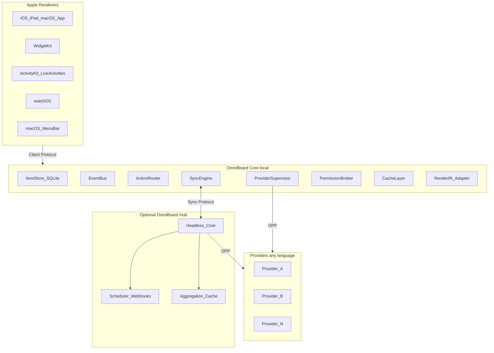

# 01 — System Overview

## Purpose

Define the overall OmniBoard architecture: actors, trust boundaries, protocols, and how data flows from providers to Apple renderers. This document is the entry point; deeper contracts live in sibling docs.

## Actors

| Actor | Role |
| ----- | ---- |
| **Core** | Local (or Hub-embedded) runtime: data model, Render IR validation, provider lifecycle, sync, events, actions, permissions, caching |
| **Provider** | Out-of-process worker that owns domain knowledge and emits Items + optional RenderDocuments |
| **Renderer** | SwiftUI consumer of validated Render IR (app, WidgetKit, ActivityKit, watchOS, menu bar) |
| **Hub** | Optional headless Core: aggregation, scheduling/webhooks, provider hosting, multi-device sync, caching — no UI |
| **User** | Configures providers, grants permissions, layouts BoardSurfaces, invokes actions |

## System shape



## Protocols (three faces, one Core)

| Protocol | Peers | Default channel |
| -------- | ----- | --------------- |
| **OPP** (OmniBoard Provider Protocol) | Core ↔ Provider | stdio (Unix socket / TCP optional) |
| **Client Protocol** | Renderer ↔ Core | XPC or local socket |
| **Sync Protocol** | Core ↔ Hub | TLS over TCP / WebSocket (codec-negotiated) |

Semantic messages, codecs, and channels are never conflated — see [10-transport-abstraction.md](10-transport-abstraction.md).

## Data flow (happy path)

1. User installs and configures a provider; Core starts a supervised process ([03](03-provider-lifecycle.md)).
2. Provider completes OPP `initialize` with capability negotiation ([08](08-plugin-protocol.md)).
3. Provider pushes `items/changed` (snapshot or delta); Core validates payloads and Render IR, writes SQLite ([04](04-data-model.md), [05](05-rendering-schema.md)).
4. Event Bus notifies interested clients ([06](06-event-system.md)).
5. Renderers read Items / RenderDocuments from Core (or cached snapshots for WidgetKit/ActivityKit) and map IR → SwiftUI.
6. User actions go Core → permission check → `actions/execute` on provider → typed result ([07](07-action-system.md)).

## Trust boundaries

```
┌─────────────────────────────────────────────────────────┐
│ Apple app sandbox                                       │
│  ┌──────────────┐    Client Protocol    ┌────────────┐  │
│  │  Renderers   │◄─────────────────────►│    Core    │  │
│  └──────────────┘                       │  (trusted) │  │
│                                         └─────┬──────┘  │
│                                               │ OPP     │
│                                         ┌─────▼──────┐  │
│                                         │ Providers  │  │
│                                         │ (untrusted)│  │
│                                         └────────────┘  │
└─────────────────────────────────────────────────────────┘
          │ Sync Protocol (optional)
          ▼
   ┌─────────────┐
   │ Hub (Core)  │
   └─────────────┘
```

Providers are **untrusted** relative to Core: process isolation, permission allowlists, no secret persistence. See [18-security-model.md](18-security-model.md).

## Implementation targets

| Component | Target | Notes |
| --------- | ------ | ----- |
| Core + Hub | Rust | One embeddable runtime; FFI to Swift; same binary for local and server |
| Clients | Swift / SwiftUI | App, widgets, Live Activities, Watch, menu bar |
| Providers | Any language | Official SDKs later; OPP is the contract |

## Normative rules

1. Renderers **must not** call providers directly.
2. Providers **must not** embed SwiftUI, HTML, or pixel layout; they emit Render IR and/or typed payloads.
3. Core **must not** interpret domain payload fields beyond schema validation against registered types.
4. Hub **must** be Core in headless mode (shared codebase), not a fork.
5. Local-only mode **must** work with Hub unavailable and with no network phoning home required by Core itself.

## Non-goals

- Cross-platform non-Apple first-party UIs in v1
- In-process native provider plugins
- Requiring Hub or any cloud service for basic operation

## Tradeoffs

| Choice | Benefit | Cost |
| ------ | ------- | ---- |
| Rust Core | Embeddable + Hub dual use, memory safety | Steeper Swift FFI investment vs pure Swift Core |
| OPP JSON-RPC | Trivial authoring in any language | Less schema rigidity than protobuf-first (mitigated by JSON Schema + golden fixtures) |
| Render IR middle ground | Multi-surface + sandboxed providers | Must carefully size the IR vocabulary ([21](21-risks-and-tradeoffs.md)) |

## Related

- [02-core-responsibilities.md](02-core-responsibilities.md)
- [08-plugin-protocol.md](08-plugin-protocol.md)
- [19-repository-layout.md](19-repository-layout.md)
