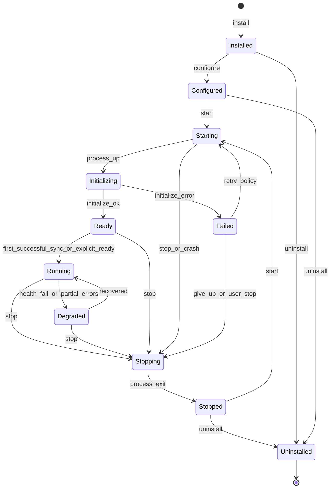

# 03 — Provider Lifecycle

## Purpose

Specify the supervised lifecycle of a provider instance from install through uninstall, including restart policies and degraded operation.

## State machine



### States

| State | Meaning |
| ----- | ------- |
| `Installed` | Package verified and registered; not configured |
| `Configured` | User settings + secret refs valid against config schema |
| `Starting` | Supervisor spawning process / attaching transport |
| `Initializing` | OPP `initialize` capability negotiation in progress |
| `Ready` | Handshake complete; may not yet have pushed items |
| `Running` | Healthy; producing items / serving actions |
| `Degraded` | Alive but failing fetches, rate-limited, or auth-expired; last-good data retained |
| `Failed` | Crash loop or fatal initialize error under restart policy |
| `Stopping` | Graceful `shutdown` requested |
| `Stopped` | Process not running; config retained |
| `Uninstalled` | Package and instance removed; secrets revoked |

## Lifecycle operations

| Operation | Actor | Effects |
| --------- | ----- | ------- |
| `install` | User / Hub admin | Verify signature/hash; register manifest; default grants pending |
| `configure` | User | Write config document; bind secret refs; validate JSON Schema |
| `start` | User / supervisor | Spawn process; open OPP channel |
| `initialize` | Core ↔ Provider | Exchange `oppVersion`, capabilities, instance config (sans raw secrets unless injected) |
| `stop` | User / supervisor | OPP `shutdown`; SIGTERM; escalate to SIGKILL after timeout |
| `uninstall` | User | Stop if needed; delete instance data per retention policy; revoke secrets |

## Restart policy

Normative defaults (overridable per instance):

```json
{
  "restartPolicy": {
    "enabled": true,
    "maxRetries": 5,
    "backoffMs": [500, 1000, 2000, 5000, 15000],
    "resetWindowMs": 600000,
    "onAuthExpired": "degrade_no_restart",
    "onPermissionDenied": "degrade_no_restart"
  }
}
```

Rules:

1. Unexpected process exit in `Running`/`Ready` → restart with exponential backoff unless policy disables.
2. `AuthExpired` / `PermissionDenied` → transition to `Degraded`; **do not** tight-loop restart.
3. Exceeding `maxRetries` within `resetWindowMs` → `Failed`; surface error to UI; require user action or Hub alert.
4. Core **must** preserve last-good Items across restarts.

## Health and readiness

- Supervisor may send OPP `provider/ping` (or rely on transport heartbeat — [09](09-ipc-protocol.md)).
- Provider emits `provider/status` notifications: `ready` | `degraded` | `stopping` with optional `reasonCode`.
- UI maps status to chips; renderers continue showing cached Items.

## Example status notification

```json
{
  "jsonrpc": "2.0",
  "method": "provider/status",
  "params": {
    "state": "degraded",
    "reasonCode": "RateLimited",
    "retryAfterMs": 60000,
    "message": "GitHub API rate limit exceeded"
  }
}
```

## Normative rules

1. Every transition **shall** emit a Core EventBus event `provider.lifecycle` with `{ instanceId, from, to, reason }`.
2. Providers **shall** treat `initialize` as idempotent if re-attached after supervisor reconnect.
3. Uninstall **shall** not leave usable long-lived tokens in the provider working directory.
4. Hub-hosted providers use the **same** state machine; only the supervisor deployment differs.

## Non-goals

- Hot-swap of provider binary without stop/start in v1
- In-process reload of native code
- Guaranteeing zero item loss if a provider lies about revisions (revision honesty is a provider contract)

## Tradeoffs

Aggressive restart improves resilience but can amplify rate limits and auth storms — hence special-casing `AuthExpired` / `PermissionDenied` into `Degraded` without restart.

## Related

- [08-plugin-protocol.md](08-plugin-protocol.md)
- [09-ipc-protocol.md](09-ipc-protocol.md)
- [16-error-handling.md](16-error-handling.md)
