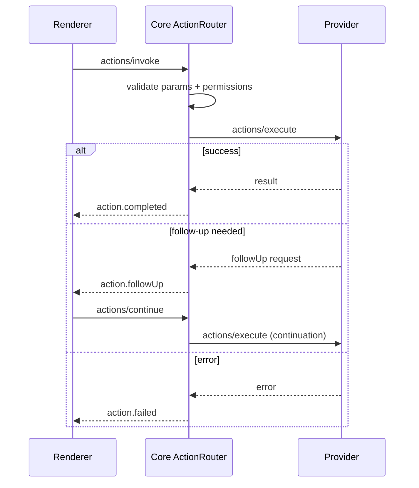

# 07 — Action System

## Purpose

Define how providers declare actions, how UI invokes them through Core, permission checks, typed results, and interactive follow-ups (auth, confirm).

## Flow



## Declaration

Actions live on the `ProviderManifest` and may be referenced from Items:

```json
{
  "id": "com.example.flight.checkIn",
  "titleKey": "action.checkIn",
  "paramsSchema": {
    "type": "object",
    "properties": {
      "confirmation": { "type": "string" }
    },
    "required": ["confirmation"]
  },
  "resultSchema": {
    "type": "object",
    "properties": {
      "ok": { "type": "boolean" },
      "boardingPassUri": { "type": "string", "format": "uri" }
    },
    "required": ["ok"]
  },
  "permissions": ["network.hosts"],
  "destructive": false,
  "idempotent": true
}
```

Render IR `ActionButton` nodes reference `actionId` ([05](05-rendering-schema.md)).

## Invocation (Client Protocol)

```json
{
  "jsonrpc": "2.0",
  "id": 10,
  "method": "actions/invoke",
  "params": {
    "invocationId": "inv_01J…",
    "actionId": "com.example.flight.checkIn",
    "providerInstanceId": "inst_flight_1",
    "itemId": { "providerInstanceId": "inst_flight_1", "localId": "AA100" },
    "params": { "confirmation": "ABC123" },
    "idempotencyKey": "inv_01J…"
  }
}
```

Core:

1. Resolves action schema from manifest.
2. Validates params.
3. Checks user grants for required permissions ([12](12-permissions.md)).
4. Forwards OPP `actions/execute` with the same `invocationId` / `idempotencyKey`.
5. Emits bus events ([06](06-event-system.md)).

## OPP execute

```json
{
  "jsonrpc": "2.0",
  "id": 3,
  "method": "actions/execute",
  "params": {
    "invocationId": "inv_01J…",
    "actionId": "com.example.flight.checkIn",
    "itemId": { "localId": "AA100" },
    "params": { "confirmation": "ABC123" },
    "idempotencyKey": "inv_01J…",
    "continuation": null
  }
}
```

### Result

```json
{
  "jsonrpc": "2.0",
  "id": 3,
  "result": {
    "status": "ok",
    "value": { "ok": true, "boardingPassUri": "https://…" }
  }
}
```

### Follow-up

```json
{
  "jsonrpc": "2.0",
  "id": 3,
  "result": {
    "status": "followUp",
    "followUp": {
      "kind": "confirm",
      "messageKey": "checkIn.confirmSeat",
      "schema": {
        "type": "object",
        "properties": { "accepted": { "type": "boolean" } },
        "required": ["accepted"]
      }
    }
  }
}
```

Supported `followUp.kind` values (v1): `confirm`, `input`, `auth` (triggers Core auth UX — [11](11-authentication.md)), `openUrl` (user must confirm).

Continuation:

```json
{
  "method": "actions/execute",
  "params": {
    "invocationId": "inv_01J…",
    "continuation": { "step": 1, "params": { "accepted": true } }
  }
}
```

## Offline queue

When the provider is unavailable, Core **may** queue invocations with `idempotencyKey` for later delivery ([15](15-offline-behavior.md)). Destructive non-idempotent actions **shall** require online confirmation unless the manifest marks `idempotent: true` and the user opts into queuing.

## Normative rules

1. UI **shall not** call providers directly for actions.
2. Core **shall** reject invocations that fail schema or permission checks with `PermissionDenied` / `InvalidParams`.
3. Providers **shall** honor `idempotencyKey` for at-least-once Core retries.
4. Action results **shall** be validated against `resultSchema` before emission to clients.

## Non-goals

- Arbitrary scripting / macros across providers in v1
- Long-running workflow engines (use follow-ups + item updates instead)
- Silent background actions that bypass user-visible invocation without manifest declaration

## Tradeoffs

Request chaining for follow-ups is more complex than fire-and-forget, but keeps auth and confirmation in Core UX instead of ad-hoc provider webviews.

## Related

- [05-rendering-schema.md](05-rendering-schema.md)
- [11-authentication.md](11-authentication.md)
- [12-permissions.md](12-permissions.md)
