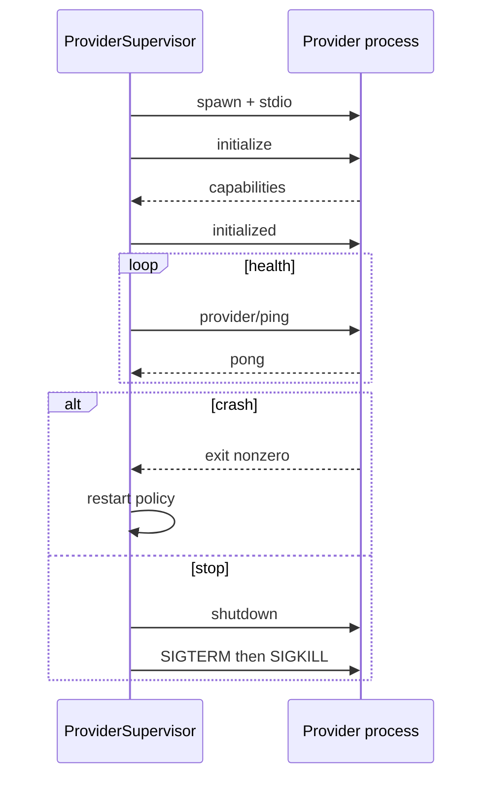

# 09 — IPC Protocol

## Purpose

Specify framing, channels, and supervision mechanics for OPP (and, by analogy, local Client Protocol). Semantic methods live in [08](08-plugin-protocol.md); this document covers how bytes move and how processes are supervised.

## Layering reminder

```
Semantic messages (OPP)  →  Codec (JSON / MessagePack)  →  Channel (stdio / socket / …)
```

See [10-transport-abstraction.md](10-transport-abstraction.md).

## Default channel: stdio

1. Core spawns the provider process with stdin/stdout connected.
2. stderr is captured for logs (not framed OPP).
3. One JSON-RPC message per frame on stdin/stdout.

### Framing

**v1 canonical framing:** Content-Length headers (LSP-compatible):

```
Content-Length: 123\r\n
\r\n
{…json…}
```

Rules:

1. Headers are ASCII; body is UTF-8 JSON unless MessagePack was negotiated (then `Content-Type: application/vnd.omniboard.msgpack`).
2. `Content-Length` is the body byte length.
3. Messages **must not** rely on newline-delimited JSON alone (NDJSON may be offered later as a capability; not default).

### Environment on spawn

| Variable | Purpose |
| -------- | ------- |
| `OMNIBOARD_INSTANCE_ID` | Provider instance id |
| `OMNIBOARD_OPP_VERSION` | Core’s preferred OPP version |
| `OMNIBOARD_CHANNEL` | `stdio` \| `unix` \| `tcp` |
| `OMNIBOARD_SOCKET` | Path or host:port when not stdio |
| Secret injection | Ephemeral env or companion FD — [11](11-authentication.md) |

Working directory is a per-instance jail path with no secret files by default.

## Optional channels

| Channel | Use |
| ------- | --- |
| Unix domain socket | Prefer when stdio is awkward (some runtimes) or for Hub sidecars |
| TCP localhost | Dev only unless TLS + auth configured |
| TCP remote | Hub-hosted providers; require auth + TLS |
| XPC | **Client Protocol** (renderers ↔ Core), not OPP default |

After connect, framing matches stdio.

## Supervision



### Timeouts (defaults)

| Phase | Timeout |
| ----- | ------- |
| Spawn to first byte | 5s |
| `initialize` response | 10s |
| `shutdown` graceful | 5s |
| Then SIGKILL | immediate |
| `provider/ping` | 5s; 3 misses → treat as crash |

Exact values are configuration; normative requirement is that they exist and are enforced.

## Process isolation requirements

1. Providers run **out-of-process**; no in-process native plugins in v1.
2. Network and FS enforcement uses OS mechanisms + Core proxy where applicable ([12](12-permissions.md)).
3. Crash of provider **must not** crash Core.
4. Multiple instances of the same manifest are separate processes.

## Client Protocol IPC (brief)

Apple renderers talk to Core via XPC (preferred on Apple platforms) or a local socket using the **same JSON-RPC framing** and a distinct method catalog (`items/*`, `events/*`, `actions/*`, `surfaces/*`). OPP methods are not exposed on Client Protocol.

## Normative rules

1. Core **shall** implement stdio + Content-Length framing as the mandatory OPP baseline.
2. Providers **shall** treat stderr as best-effort diagnostics; they must not write OPP frames to stderr.
3. Half-closed stdio **shall** be treated as provider failure.
4. Hub **shall** use the same framing for local and remote providers; only the channel differs.

## Non-goals

- Shared-memory item transport in v1
- Multiplexing multiple provider instances on one stdio pipe
- Replacing OPP with gRPC as the required path

## Tradeoffs

LSP-style framing is slightly more complex than NDJSON but benefits from decades of tooling and unambiguous binary-safe lengths (needed for MessagePack).

## Related

- [08-plugin-protocol.md](08-plugin-protocol.md)
- [03-provider-lifecycle.md](03-provider-lifecycle.md)
- [10-transport-abstraction.md](10-transport-abstraction.md)
