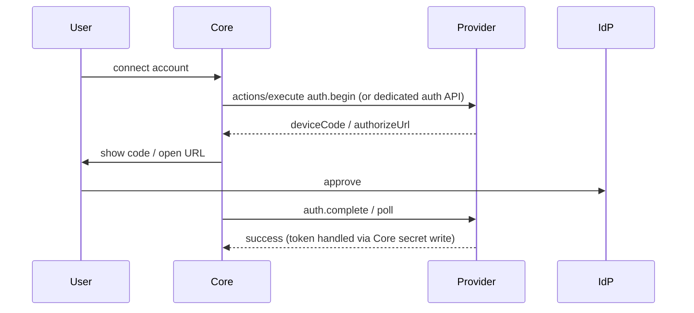

# 11 — Authentication

## Purpose

Describe secret storage, injection into providers, OAuth/device flows for third-party APIs, and Hub authentication. Providers must not become secret custodians.

## Principles

1. **Secrets live in OS keychain (local) or encrypted secret store (Hub).**
2. Core holds **secret refs**; providers receive **ephemeral** credentials.
3. Providers **must not** persist secrets to their working directory or logs.
4. User-facing OAuth/device UX is orchestrated by Core (or Hub admin UX), not ad-hoc provider HTML.

## Secret refs

Config documents store references, not values:

```json
{
  "config": {
    "apiBase": "https://api.airline.example"
  },
  "secretRefs": {
    "apiToken": "secret:inst_flight_1/apiToken"
  }
}
```

### Injection modes (negotiated / platform-dependent)

| Mode | Mechanism |
| ---- | --------- |
| Env | Ephemeral environment variable at spawn; wiped on stop |
| OPP secure param | Short-lived token field on `initialize` / `config/updated` over the already-isolated channel |
| Companion FD | Unix SCM_RIGHTS / sealed file descriptor (optional hardening) |

Core **shall** rotate ephemeral material when policies require and on each restart when practical.

## Provider auth to third parties

### API tokens

1. User pastes token in Core UI (or Hub).
2. Core writes to keychain/secret store; config gets a ref.
3. Provider uses injected token for upstream HTTP.

### OAuth / device code



Preferred pattern: Core performs token storage; provider receives only injected access tokens. If a provider must complete the exchange itself, it returns tokens to Core via OPP result for storage and **deletes** local copies.

`followUp.kind = "auth"` on actions triggers the same UX ([07](07-action-system.md)).

## Hub authentication

| Concern | Approach |
| ------- | -------- |
| Device ↔ Hub | Mutual auth (device identity keys / user account session) over TLS |
| Admin access | Separate from provider secrets; RBAC later |
| Provider remote channel | Authenticated before OPP initialize |
| Secret store | Encrypted at rest; per-tenant keys when multi-user Hub exists |

Local Core **does not** require a Hub account.

## Auth-related errors

| Code | UI behavior |
| ---- | ----------- |
| `AuthExpired` | Degrade provider; prompt re-auth; do not crash-loop ([03](03-provider-lifecycle.md)) |
| `PermissionDenied` | Distinct from auth; show grants UI ([12](12-permissions.md)) |

## Normative rules

1. Manifests **shall** declare which config keys are secret-backed.
2. Logs and EventBus payloads **shall** redact secrets and tokens.
3. Uninstall / revoke **shall** delete secret refs from the store.
4. Providers **shall** treat injected credentials as session-scoped.

## Non-goals

- OmniBoard becoming a general password manager
- Shared long-lived credentials across unrelated provider instances by default
- Embedding third-party login WebViews inside providers without Core mediation

## Tradeoffs

Core-orchestrated OAuth adds protocol surface, but prevents each provider from shipping fragile auth UIs and secret storage bugs.

## Related

- [12-permissions.md](12-permissions.md)
- [18-security-model.md](18-security-model.md)
- [07-action-system.md](07-action-system.md)
